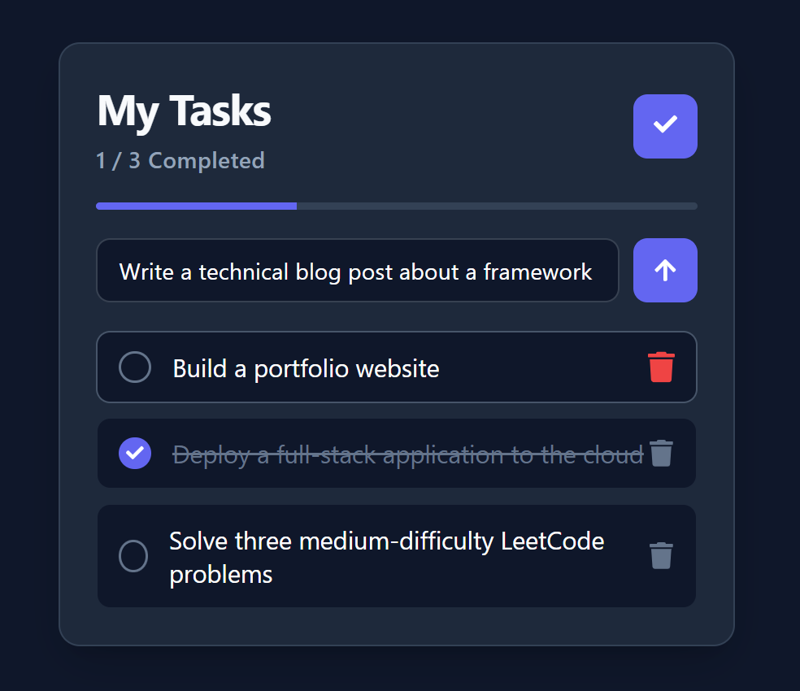
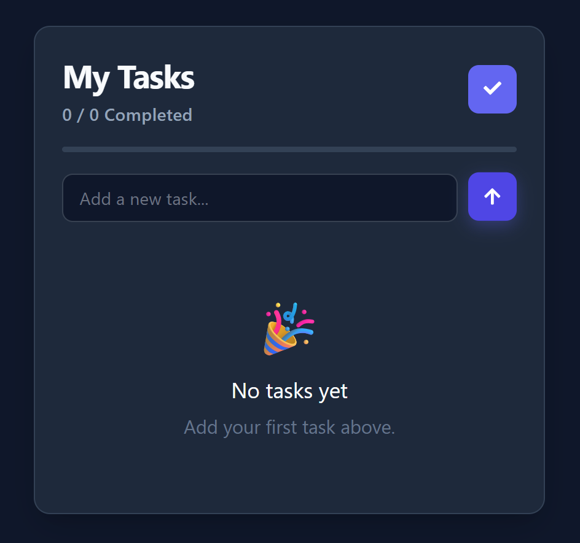

# 🚀 React Todo App

A modern and responsive Todo application built with **React**. It features a sleek dark-themed interface, real-time progress tracking, and an intuitive user experience for managing daily tasks.

## ✨ Features

- ➕ Add new tasks
- ✅ Mark tasks as completed
- 🔄 Mark all tasks as completed
- 🗑️ Delete tasks
- 📊 Real-time progress bar
- 📈 Completed task counter
- 🌙 Modern dark theme
- ⌨️ Press **Enter** to quickly add a task
- 📱 Clean and responsive user interface

## 🛠️ Tech Stack

- React
- JavaScript (ES6+)
- CSS3
- Vite
- UUID
- React Icons

## 📸 Screenshots

### Tasks View

### Empty State

